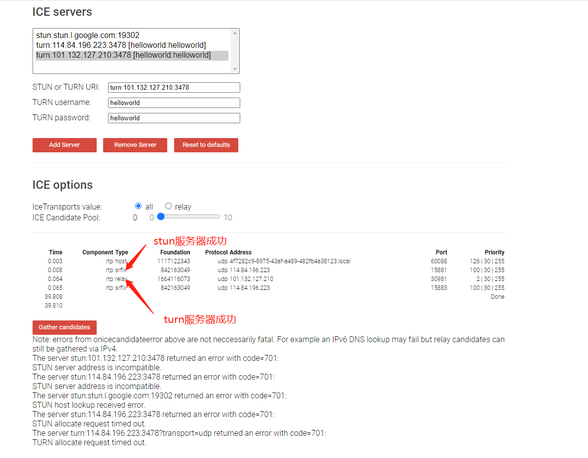
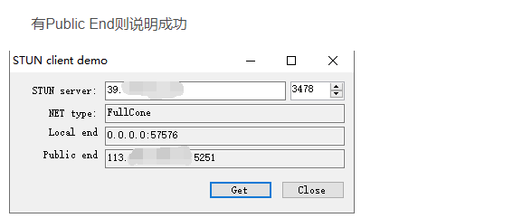
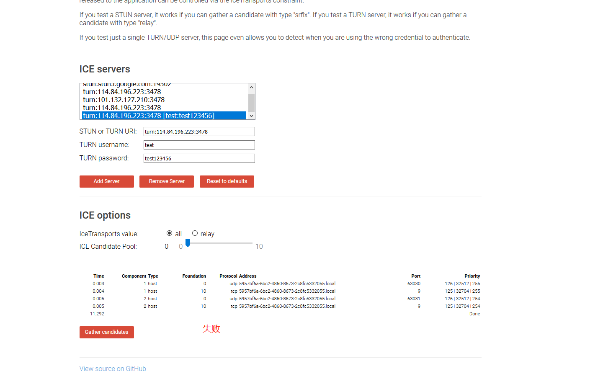

## turn服务器搭建

### 搭建结果

**阿里云ubuntu16是搭建成功，并且用测试网址穿透通过；window系统搭建成功，但是turn不通，测试网址不能穿过。**


## 可用版本

## 阿里云服务器(Ubuntu18.04版本)中安装coturn穿透服务器

- - 一、安装依赖库
  - 二、下载源码并编译安装
  - 三、coturn启动命令
  - 四、阿里云端口配置
  - 五、安装、配置完成后测试


#### 一、安装依赖库

```javascript
sudo apt-get update 
sudo apt-get install libssl-dev libevent-dev libpq-dev mysql-client libmysqlclient-dev libhiredis-dev make -y
sudo apt-get install gdebi-core -y
sudo apt-get install sqlite libsqlite3-dev -y
sudo apt-get install git -y
```

#### 二、下载源码并编译安装

```javascript
git clone https://github.com/coturn/coturn
cd coturn
./configure --prefix=/usr/local/coturn
make && make install
cd /usr/local/coturn/etc/
cp turnserver.conf.default turnserver.conf
```

安装成功后：


####  三、coturn启动命令

```javascript
nohup ./bin/turnserver --syslog -a -L 172.17.33.244 -X 47.93.25.18 -E 172.17.33.244 -f --min-port=30000 --max-port=31000 --user=helloworld:helloworld -r helloworld --cert=turn_server_cert.pem --pkey=turn_server_pkey.pm --log-file=stdout -v  > /usr/local/turn.log &
```

**172.17.33.244为阿里云服务器内网IP，47.93.25.18为阿里云服务器外网IP(请自行修改)**
**min-port、max-port为开放的端口范围，在阿里云安全组中需要配置(请自行修改)**
**helloworld:helloworld -r helloworld为用户名、密码(请自行修改)**

####  四、阿里云端口配置

**注意：需要开通3478(coturn默认端口)、30000-31000端口(启动命令中配置的最小-最大端口)，对应端口的tcp、udp都要配置**


#### 五、安装、配置完成后测试

```javascript
//查看coturn是否启动
netstat -ntpl
```


**此时仅说明服务器上启动成功，但还需要在网页上进行测试：**

```javascript
//访问该地址：
https://webrtc.github.io/samples/src/content/peerconnection/trickle-ice/
//输入自己配置的服务器地址、用户名、密码：
turn:47.93.25.18:3478 
helloworld 
helloworld
//点击Add Server后再点击Gather Cnadidates
```


**注意：只有对应服务器上有relay映射回来才算搭建成功！！**

下图为测试成功



NAT类型测试工具




## 对比windows版本

#### Windows上架设Turn服务器

一、安装Cygwin，下载地址：https://cygwin.com/install.html

注意：①镜像源地址：http://mirrors.163.com/cygwin/；

​      ②需要gcc编译工具，安装时把Devel设为Install

二、安装libevent2库

1.http://libevent.org/，下载libevent2库，解压；

2.打开Cgywin进去到libevent2目录

3.在Cgywin运行./configure命令，没问题后运行make && make install 命令

三、下载coturn源码，https://codeload.github.com/coturn/coturn/zip/4.5.0.4

解压后，把coturn-4.5.0.4文件夹放在cygwin的安装路劲C:\cygwin64\bin下。后面就开始编译了。

运行 ./configure命令；

运行make命令；

运行make install命令;

四、coturn具体配置

1.生成证书，在coturn源文件夹右键打开cgywin，输入命令，openssl req -x509 -newkey rsa:2048 -keyout /etc/turn_server_pkey.pem -out /etc/turn_server_cert.pem -days 99999 –nodes，根据提示一步步输入信息即可。

2.创建turnserver.conf，在cygwin64\etc目录下创建turnserver.conf，输入内容：

listening-ip=服务器内网地址
listening-port=3478
tls-listening-port=5349
relay-ip=服务器内网地址
external-ip=服务器外网地址
relay-threads=50
lt-cred-mech
cert=/etc/turn_server_cert.pem
pkey=/etc/turn_server_pkey.pem
pidfile=”/var/run/turnserver.pid”
min-port=49152
max-port=65535
user=用户名:密码
realm=test

3.启动服务，在cygwin64\etc目录下输入 turnserver -o -a -f -user=用户名:密码 -r test

五：webrtc配置

var configuration = {
  "iceServers": [{
     url: "turn:公网地址:3478?transport=tcp",
     username: "账户", 
     credential: "密码"
  }]};


**对应服务器上有relay没有映射回来，搭建失败！！**

下图为测试失败




**注意点**

1.目前测试windows系统打通了stun服务，turn不通（待更新）。

2.测试网址浏览器问题，chrome会出现701警告，火狐没问题，查询该警告不影响。


**参考资料**：

https://blog.csdn.net/n_fly/article/details/100055945

https://blog.csdn.net/weixin_40288995/article/details/82866303

- 有对stun通，turn不通的讨论，

https://www.cnblogs.com/wunaozai/p/9071097.html

https://blog.csdn.net/u014338577/article/details/109348236